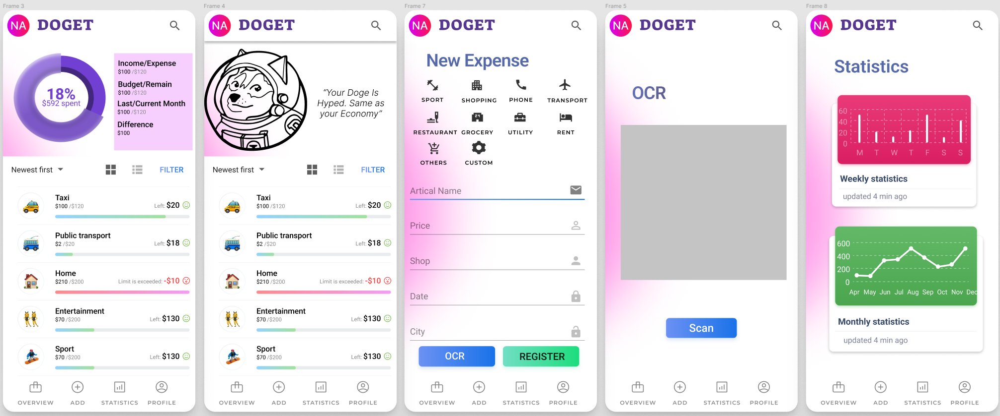

# DOGET - Accounting App that makes you closer to Musk

**This is the course project for ID2216 - Developing Mobile Applications**

 Nowadays, smart phones are so widely used and almost become part of the daily life for a large proportion of people, and applications that serve multifarious purposes are designed, some of which are made to help people track their expenses and maintain a budget.  Our application is developed with several tools, with Figma for the UI design, and Pxcode is used to transfer the design into codes for React-Native. Then the app is built with React-Native. We use JavaScript for the front-end, and the back-end codes are written in JAVA and Kotlin.

## UI Layout Screenshot


## Screen Recording Demo
[YouTube](https://youtu.be/kSSZUDAUx6Y)

## APK Path
"native/apk"  
[APK Download](https://github.com/GiantPanda0090/ID2216_Doget/tree/main/native/apk)
## Web

The **webui** is developed with javascript and HTML to build a web version of our applications.

To use the webui, first install the nodejs packages (if you dont have nodejs, you need to install it first)

```cd webui/my-app/ && npm install```

Then you can use our webui with a single ```npm start```

## Native 

The final version of our app is designed with React-Native. To run our project, you need to first install required tools for reactive native following [this guidance](https://docs.microsoft.com/en-us/windows/dev-environment/javascript/react-native-for-android).

Next, install SDK and VM in Android Studio. We're using SDK27 and pixel 5 with android 8.1.

Then, follow the instructions below:

1. install packages

```cd native/native_project && npm install```

note that you can also use ```yarn install```

2. run the project with react-native

```npx react-native run-android```

Then you can test our app!
